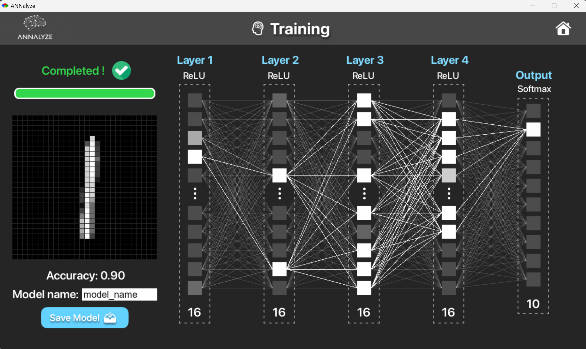

# ANNalyze - Neural Network for Handwritten Digit Recognition

## Project Overview

**ANNalyze** is a **Neural Network** application built using **Ruby** that allows users to create and train their own neural network to predict hand-written digits. This project was developed as part of the **COS10009 - Introduction to Programming** unit at **Swinburne University**. The application utilizes the **Multilayer Perceptron (MLP)** model to recognize digits from the **MNIST dataset**, a popular benchmark for handwritten digit recognition.

The program achieves real-time predictions by training the neural network on the MNIST dataset, providing an educational demonstration of how neural networks work, from training to inference.

This project was awarded a **perfect final result of 100%**, and I am proud to share it with you as a part of my studies in artificial intelligence and machine learning.

## Demo
[](https://www.youtube.com/watch?v=DCoeUoZj2y8 "ANNalyze - Neural Network Demo")
*Click the image to watch the demo video on YouTube*


## Screenshots

*Figure 1: Building Screen*


*Figure 2: Training Screen*


*Figure 3: Inference Screen*

## Features

- **Handwritten Digit Recognition**: Train and test a neural network to recognize digits from the MNIST dataset.
- **Neural Network Training**: Build and train a Multilayer Perceptron (MLP) model from scratch.
- **Real-Time Predictions**: Make predictions in real-time after training the neural network on the MNIST dataset.
- **Educational Tool**: Learn and visualize how neural networks work through a hands-on project.

## Installation

### Prerequisites

Before running the application, make sure you have **Ruby** installed on your system. You can download it from the official [Ruby website](https://www.ruby-lang.org/en/documentation/installation/).

Additionally, you need to install the following Ruby gems:

```bash
gem install numo-narray
gem install ruby2d
gem install savio
```

These libraries are necessary for matrix operations, graphical display, and saving/loading network models, respectively.

## Running the program

1. **Clone or Download the Repository**:
    ```bash
    git clone https://github.com/yourusername/ANNalyze.git
    ```

2. **Navigate to the Project Directory**:
    Change to the directory where you downloaded the repository:
    ```bash
    cd ANNalyze
    ```

3. **Run the Program**:
    To run the ANNalyze Ruby program, use the following command in your terminal:
    ```bash
    ruby main.rb
    ```

## Research Project

This project is accompanied by a research paper that explains the **Multilayer Perceptron (MLP)** model used in **ANNalyze** for recognizing hand-written digits. The research discusses the key concepts of artificial neural networks, including activation functions, backpropagation, and training on the MNIST dataset.

- [**Research Project: Artificial Neural Networks for Handwritten Digit Recognition**](./Artificial_Neural_Network.pdf)

## Achievements

- **100% Final Result**: Achieved a perfect final score of **100%** for the **Introduction to Programming - COS10009** unit at Swinburne University.

If you found this repository useful or interesting, please feel free to give it a ⭐ (star). Your support is greatly appreciated!

## Acknowledgments

- **Swinburne University**: For providing an excellent learning experience in programming and artificial intelligence.
- **Professors and Teaching Assistants**: For their invaluable support and feedback during the course.
- **Ruby Community**: For maintaining the Ruby programming language and libraries that made this project possible.
- **MNIST Dataset**: For providing the dataset used to train the neural network for handwritten digit recognition.
